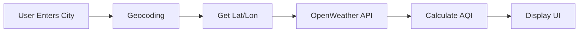

# ClearSkies Developer Guide

> A quick guide for developers working on the ClearSkies Air Quality Monitoring application

---

## Table of Contents

1. [Overview](#overview)
2. [Tech Stack](#tech-stack)
3. [Project Structure](#project-structure)
4. [Setup & Installation](#setup--installation)
5. [How to Run](#how-to-run)
6. [API Integration](#api-integration)
7. [Testing](#testing)
8. [Common Tasks](#common-tasks)
9. [Troubleshooting](#troubleshooting)

---

## Overview

**ClearSkies** is a Python web application that displays real-time air quality data using the OpenWeather API and Streamlit for the UI.

### Key Features

- 🌍 Search any location worldwide
- 📊 Real-time air quality data (PM2.5, PM10, O3, NO2, SO2, CO)
- 📈 Standardized AQI calculation (0-500 scale)
- 📅 5-day forecast with charts
- 🗺️ Interactive maps

---

## Tech Stack

| Technology | Purpose |
|------------|---------|
| Python 3.8+ | Primary language |
| Streamlit | Web UI framework |
| Requests | HTTP library for API calls |
| Pandas | Data manipulation |
| Plotly | Interactive charts |
| pytest | Testing |

**External APIs:**
- **OpenWeather Air Pollution API**: Air quality data
- **Nominatim**: Geocoding (location to coordinates)

---

## Project Structure

```
divya_project/
├── app.py                          # Main entry point
├── keys.py                         # API keys (local only, gitignored)
├── module/
│   ├── core/
│   │   ├── air_quality_api.py      # API client
│   │   ├── air_quality_models.py   # Data models
│   │   ├── aqi_calculators.py      # AQI conversion
│   │   └── geocoding.py            # Location search
│   └── streamlit_ui/
│       ├── location.py             # Location input
│       ├── aqi_display.py          # AQI widgets
│       ├── main_display.py         # Dashboard
│       └── plots.py                # Charts
├── tests/                          # Test files
└── docs/                           # Documentation
```

**Key Modules:**
- `core/`: Business logic and API integration
- `streamlit_ui/`: UI components and layouts
- `tests/`: Unit and integration tests

---

## Setup & Installation

### Prerequisites

- Python 3.8+
- pip
- Git
- OpenWeather API key ([Get one free here](https://openweathermap.org/api))

### Quick Setup

1. **Clone and Navigate**
   ```bash
   git clone https://github.com/Divya89838983/divya_project.git
   cd divya_project
   ```

2. **Create Virtual Environment** (Recommended)
   ```bash
   python3 -m venv venv
   source venv/bin/activate  # On Windows: venv\Scripts\activate
   ```

3. **Install Dependencies**
   ```bash
   pip install streamlit requests pandas plotly pytest
   ```

4. **Set Up API Key**
   
   Create `keys.py` in the project root:
   ```python
   # keys.py
   appid = "your_openweather_api_key_here"
   ```
   
   ⚠️ **Note**: This file is gitignored and won't be committed.


---

## API Integration

### OpenWeather API

**Endpoint:** `http://api.openweathermap.org/data/2.5/air_pollution/forecast`

**Parameters:**
- `lat`: Latitude
- `lon`: Longitude  
- `appid`: Your API key

### Data Flow



### Example API Call

```python
url = f"http://api.openweathermap.org/data/2.5/air_pollution/forecast?lat={lat}&lon={lon}&appid={appid}"
response = requests.get(url)
data = response.json()
```

### Sample Response

```json
{
  "coord": {"lon": -93.62, "lat": 42.034},
  "list": [{
    "dt": 1702555200,
    "main": {"aqi": 2},
    "components": {
      "pm2_5": 6.47,
      "pm10": 8.12,
      "o3": 68.41,
      "no2": 8.52,
      "so2": 1.89,
      "co": 270.35
    }
  }]
}
```

### AQI Calculation

The app converts raw pollutant values to AQI (0-500) using EPA formulas in `aqi_calculators.py`:

```python
def PM25(val):
    if val <= 30:
        return round(val * (50/30), 2)
    elif val > 30 and val <= 60:
        return round(50 + (val-30) * (50/30), 2)
    # ... more ranges
```

---

## Testing

### Run All Tests

```bash
pytest
```

### Test Structure

```
tests/
├── core/
│   ├── test_air_quality_api.py
│   └── test_aqi_calculators.py
└── streamlit_ui/
    └── test_aqi_display.py
```

### Example Test

```python
def test_pm25_calculation():
    """Test PM2.5 AQI conversion."""
    assert PM25(12.0) == 20.0
    assert PM25(30.0) == 50.0
    assert PM25(60.0) == 100.0
```

---

## Common Tasks

### 1. Adding a New Pollutant

1. Update `air_quality_models.py`:
   ```python
   class Components:
       pm1_0: float = 0.0  # Add new field
   ```

2. Add calculator in `aqi_calculators.py`:
   ```python
   def PM1(val):
       # AQI formula here
       pass
   ```

3. Update `calculate_all_aqi_values()`:
   ```python
   return [PM1(components.pm1_0), PM25(...), ...]
   ```

4. Add to UI in `aqi_display.py`

### 2. Changing API Provider

Update `air_quality_api.py` with new API endpoint and modify `read_pollution_data_from_api()` function.

---

## Troubleshooting

### Common Issues

**"ModuleNotFoundError: No module named 'keys'"**
- Create `keys.py` with your API key

**API Returns 401**
- Check API key is valid
- Wait 10-15 minutes after creating new key

**Location Not Found**
- Try format: "City, Country" (e.g., "Paris, France")
- Check spelling

**Streamlit Won't Start**
- Check if port 8501 is already in use
- Try: `streamlit run app.py --server.port 8080`

---

## Quick Reference

### AQI Categories

| Range | Category | Color |
|-------|----------|-------|
| 0-50 | Good | Green |
| 51-100 | Moderate | Yellow |
| 101-150 | Unhealthy for Sensitive Groups | Orange |
| 151-200 | Unhealthy | Red |
| 201-300 | Very Unhealthy | Purple |
| 301-500 | Hazardous | Maroon |

### Key Files

- `app.py` - Main entry point
- `module/core/air_quality_api.py` - API calls
- `module/core/aqi_calculators.py` - AQI formulas
- `module/streamlit_ui/location.py` - Location search
- `module/streamlit_ui/aqi_display.py` - UI widgets

---

**Last Updated**: December 4, 2025  
**Project**: ClearSkies Air Quality Monitor
