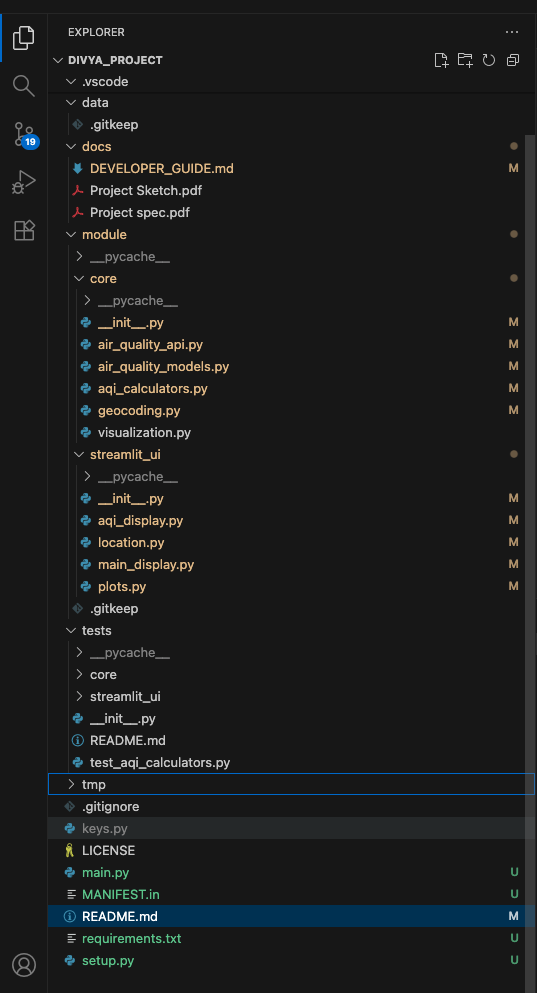
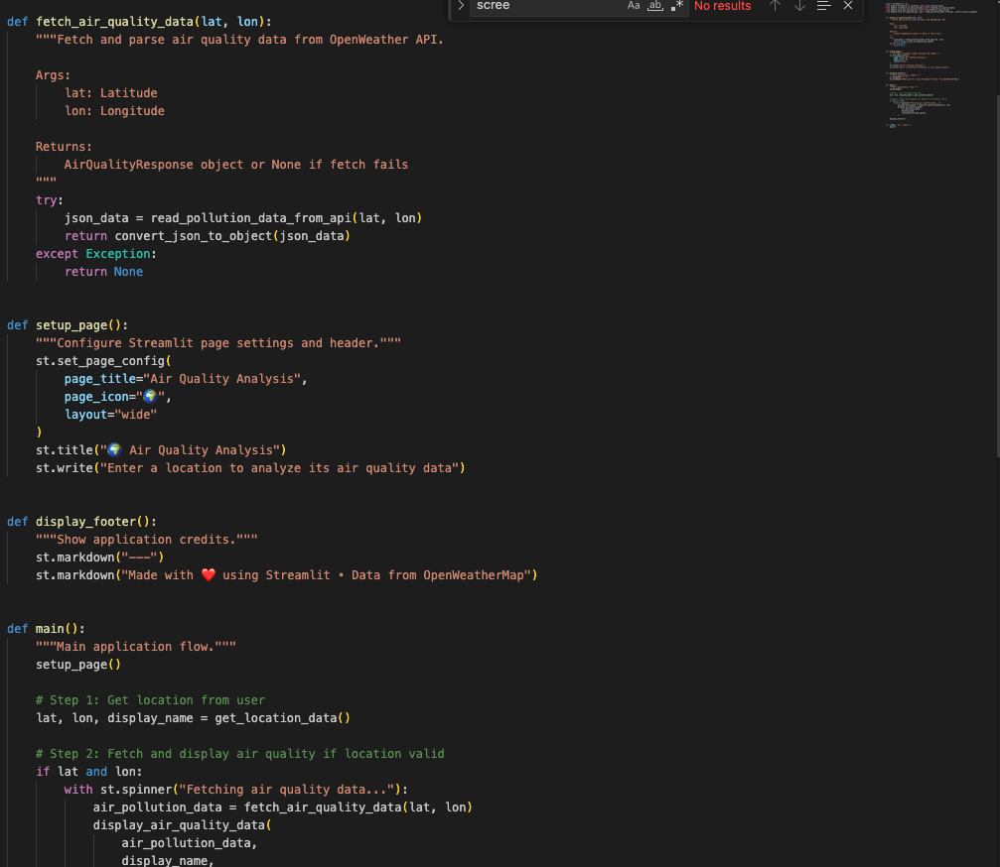
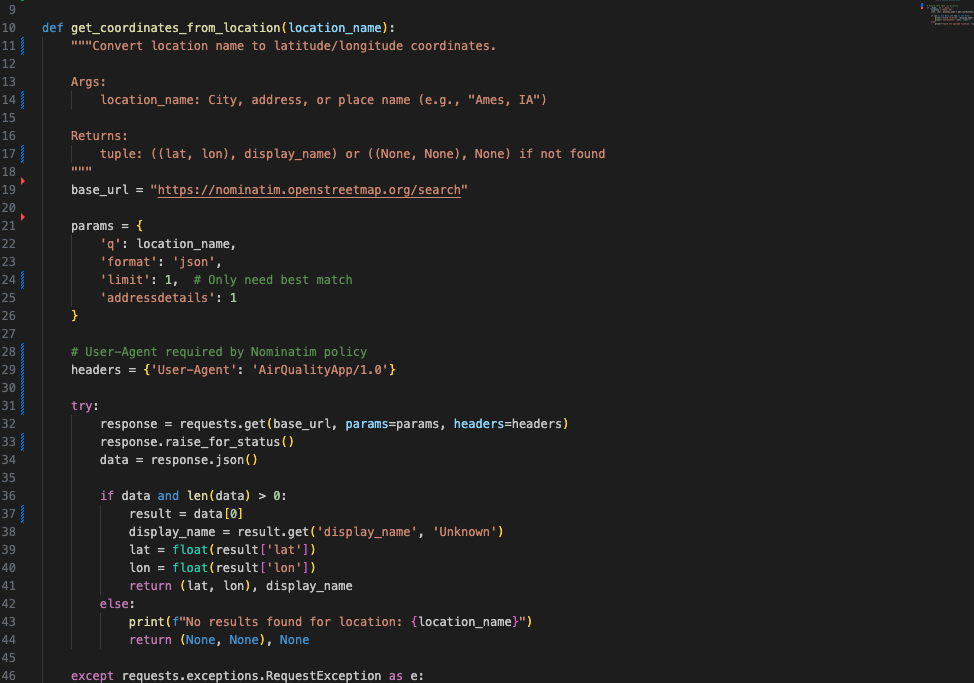
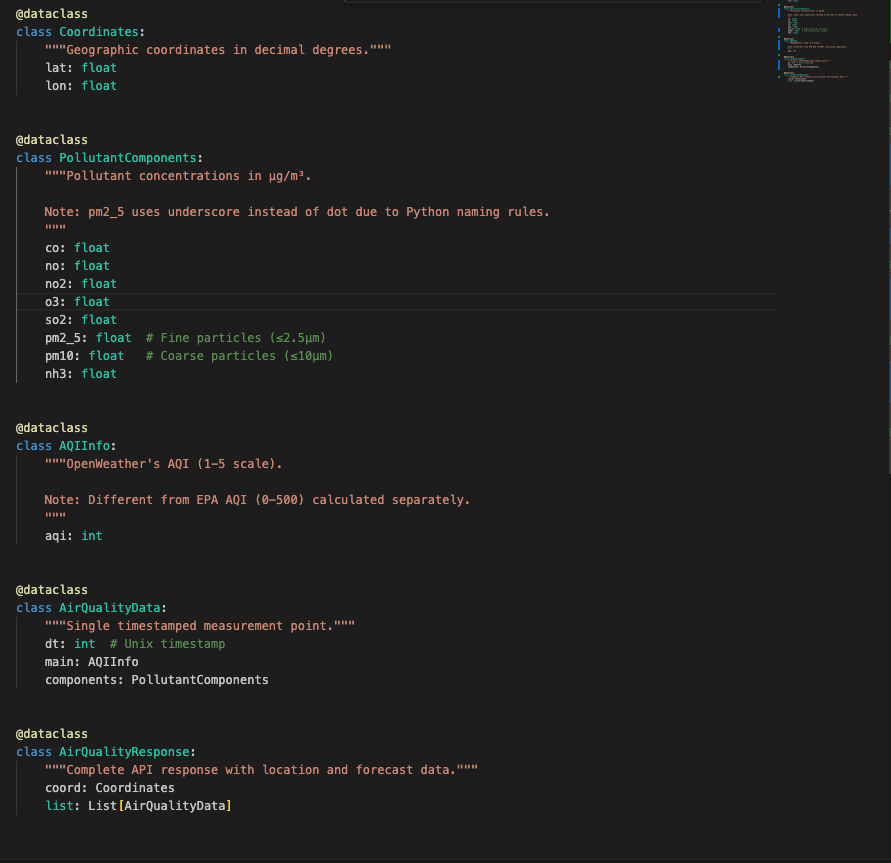
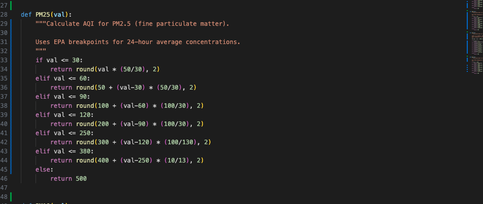
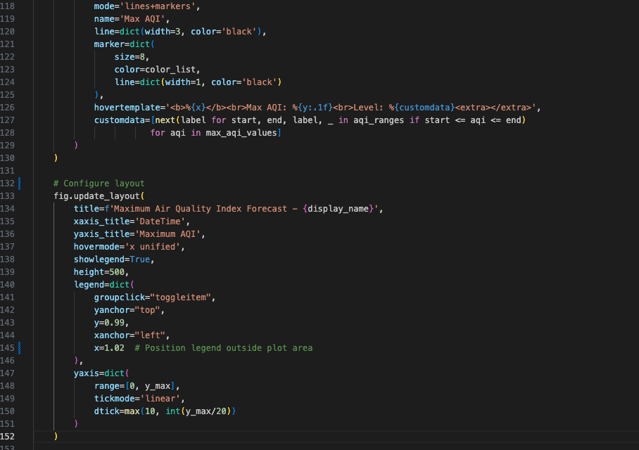
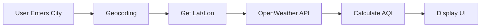

# ClearSkies Developer Guide

> A quick guide for developers working on the ClearSkies Air Quality Monitoring application

---

## Table of Contents

1. [Overview](#overview)
2. [Planning Specifications](#planning-specifications)
3. [Tech Stack](#tech-stack)
4. [Project Structure](#project-structure)
5. [Setup & Installation](#setup--installation)
6. [How to Run](#how-to-run)
7. [User Interaction & Code Walkthrough](#user-interaction--code-walkthrough)
8. [API Integration](#api-integration)
9. [Testing](#testing)
10. [Common Tasks](#common-tasks)
11. [Known Issues](#known-issues)
12. [Future Work](#future-work)
13. [Troubleshooting](#troubleshooting)
14. [Quick Reference](#quick-reference)

---

## Overview

**ClearSkies** is a Python web application that displays real-time air quality data using the OpenWeather API and Streamlit for the UI.

### Key Features

- 🌍 Search any location worldwide
- 📊 Real-time air quality data (PM2.5, PM10, O3, NO2, SO2, CO)
- 📈 Standardized AQI calculation (0-500 scale)
- 📅 5-day forecast with charts
- 🗺️ Interactive maps

---

## Planning Specifications

### Initial Goals vs. Current Implementation

**✅ Implemented Features:**
- Real-time air quality data fetching from OpenWeather API
- Location search with geocoding (Nominatim)
- AQI calculation for 6 pollutants (PM2.5, PM10, O3, NO2, SO2, CO)
- Interactive Streamlit UI with maps
- 5-day air quality forecast
- Color-coded AQI categories (Good to Hazardous)
- Responsive layout with pollutant cards
- Loading indicators for better UX
- Comprehensive error handling

**⚠️ Partially Implemented:**
- Historical data analysis (forecast available, but no historical trend analysis)
- Unit tests (basic structure in place, needs more coverage)

**❌ Not Yet Implemented:**
- Machine learning-based AQI prediction/forecasting
- Daily automated reports generation
- Pollutant contribution analysis with weights
- Data persistence/database integration
- User authentication or saved locations
- Email/notification alerts for poor air quality

---

## Tech Stack

| Technology | Purpose |
|------------|---------|
| Python 3.8+ | Primary language |
| Streamlit | Web UI framework |
| Requests | HTTP library for API calls |
| Pandas | Data manipulation |
| Plotly | Interactive charts |
| pytest | Testing |

**External APIs:**
- **OpenWeather Air Pollution API**: Air quality data
- **Nominatim**: Geocoding (location to coordinates)

---

## Project Structure

**Screenshot: Project File Structure in IDE**



*Figure: Complete project folder structure as seen in the code editor*

```
divya_project/
├── main.py                         # Main entry point - run this to start the app
├── keys.py                         # API keys (local only, gitignored)
├── setup.py                        # Package installation configuration
├── requirements.txt                # Python dependencies
├── MANIFEST.in                     # Package data configuration
├── module/
│   ├── core/
│   │   ├── air_quality_api.py      # API client
│   │   ├── air_quality_models.py   # Data models
│   │   ├── aqi_calculators.py      # AQI conversion
│   │   └── geocoding.py            # Location search
│   └── streamlit_ui/
│       ├── location.py             # Location input
│       ├── aqi_display.py          # AQI widgets
│       ├── main_display.py         # Dashboard
│       └── plots.py                # Charts
├── tests/                          # Test files
└── docs/                           # Documentation
```

**Key Modules:**
- `core/`: Business logic and API integration
- `streamlit_ui/`: UI components and layouts
- `tests/`: Unit and integration tests

---

## Setup & Installation

> **For end users**: See the [User Guide (README.md)](../README.md) for basic installation instructions.

### Development Setup

1. **Clone and Navigate**
   ```bash
   git clone https://github.com/Divya89838983/divya_project.git
   cd divya_project
   ```

2. **Create Virtual Environment**
   ```bash
   python3 -m venv venv
   source venv/bin/activate  # On Windows: venv\Scripts\activate
   ```

3. **Install in Development Mode**
   ```bash
   # Install package in editable mode with dev dependencies
   pip install -e ".[dev]"
   ```

4. **Set Up API Key**
   ```python
   # keys.py
   appid = "your_openweather_api_key_here"
   ```

### Package Installation Options

**Development Installation (Recommended for contributors):**
```bash
pip install -e .              # Editable mode - changes reflect immediately
pip install -e ".[dev]"       # With pytest and other dev tools
```

**Regular Installation:**
```bash
pip install .                                                    # From source
pip install git+https://github.com/Divya89838983/divya_project.git  # From GitHub
```

**Benefits of Package Structure:**
- Clean imports: `from module.core import aqi_calculators`
- Entry point configuration in `setup.py`
- Automatic dependency resolution
- Easy distribution

**Package Files:**
- `setup.py` - Package metadata, dependencies, entry points
- `requirements.txt` - Pinned dependencies for reproducibility  
- `MANIFEST.in` - Non-Python files to include in distribution

---

## How to Run

### Development Server

```bash
streamlit run main.py
```

**Options:**
```bash
streamlit run main.py --server.port 8080        # Custom port
streamlit run main.py --server.headless true    # No auto-open browser
streamlit run main.py --logger.level debug      # Debug logging
```

### Production Considerations

For production deployment:
- Use environment variables for API keys (not `keys.py`)
- Configure `server.enableCORS` and `server.enableXsrfProtection`
- Set up reverse proxy (nginx) for HTTPS
- Monitor API rate limits
- Implement caching for repeated location searches

---

## User Interaction & Code Walkthrough

> **For end users**: See "How to Use" section in [README.md](../README.md)

### Application Architecture

```
User Input → Geocoding → API Call → Data Processing → Visualization
```

### Code Flow Walkthrough
3. **Geocoding** → System converts location to coordinates with loading spinner
4. **Map Display** → Interactive map shows the selected location
5. **Data Fetching** → System retrieves air quality data from OpenWeather API
6. **Results Display** → Dashboard shows current AQI, pollutant details, and forecast charts
7. **New Search** → User can enter a different location to repeat the process

### Code Flow & Architecture

#### 1. Application Entry Point (`main.py`)

**Main Function: `main()`**
- Orchestrates the entire application flow
- Calls: `setup_page()`, `get_location_data()`, `fetch_air_quality_data()`, `display_air_quality_data()`

**Screenshot: Main Application Flow**



*Figure: Complete `main.py` showing application orchestration with Google-style docstrings and clean flow*

```
Flow: main() 
  ├─> setup_page()                    # Configure Streamlit page
  ├─> get_location_data()             # Handle location input
  │     ├─> st.text_input()           # Streamlit input widget
  │     ├─> get_coordinates_from_location()  # From location.py
  │     └─> display_location_info()   # Show map
  │
  ├─> fetch_air_quality_data()        # Get API data
  │     ├─> read_pollution_data_from_api()   # From air_quality_api.py
  │     └─> convert_json_to_object()         # From air_quality_api.py
  │
  ├─> display_air_quality_data()      # Show results
  │     ├─> calculate_all_aqi_values() # From aqi_calculators.py
  │     ├─> display_pollutant_details() # From aqi_display.py
  │     └─> display_aqi_forecast()     # From plots.py
  │
  └─> display_footer()                # Show credits
```

#### 2. Location Handling (`module/streamlit_ui/location.py`)

**Key Functions:**

- **`get_location_data()`**
  - Entry point for location input
  - Uses Streamlit's `st.text_input()` widget
  - Manages session state for input persistence
  - Returns: `(lat, lon, display_name)` tuple

- **`get_coordinates_from_location(location_name)`**
  - Makes HTTP request to Nominatim API
  - URL: `https://nominatim.openstreetmap.org/search`
  - Handles API errors gracefully
  - Returns: `((lat, lon), display_name)` or `((None, None), None)` on failure

**Screenshot: Geocoding Function with Docstrings**



*Figure: `get_coordinates_from_location()` function showing Google-style docstrings and inline comments for API requirements*

- **`display_location_info(lat, lon, display_name)`**
  - Creates pandas DataFrame for map visualization
  - Uses `st.map()` to display location
  - Shows success message with location name

**Important:** Uses `st.spinner()` context manager for loading states.

#### 3. API Integration (`module/core/air_quality_api.py`)

**Key Functions:**

- **`read_pollution_data_from_api(lat, lon)`**
  - Constructs OpenWeather API URL with coordinates and API key
  - Makes GET request with 10-second timeout
  - Returns: Raw JSON response
  - Error handling: Returns `None` on failure

- **`convert_json_to_object(air_pollution_json_data)`**
  - Transforms JSON into structured Python objects
  - Uses data models from `air_quality_models.py`
  - Creates: `AirQualityResponse` object containing:
    - `coord`: Coordinates object
    - `list`: Array of `AirQualityData` objects (forecast entries)

#### 4. Data Models (`module/core/air_quality_models.py`)

All data models use Python `@dataclass` decorator for clean, type-safe data representation.

**Screenshot: Data Models with Class Docstrings**



*Figure: Complete data model definitions showing dataclasses, Google-style docstrings, and inline comments*

**Class Hierarchy:**

```python
AirQualityResponse
├── coord: Coordinates
│     ├── lat: float
│     └── lon: float
└── list: List[AirQualityData]
      ├── dt: int (timestamp)
      ├── main: AQIInfo
      │     └── aqi: int (OpenWeather's own AQI)
      └── components: PollutantComponents
            ├── pm2_5: float
            ├── pm10: float
            ├── o3: float
            ├── no2: float
            ├── so2: float
            ├── co: float
            └── nh3: float
```

#### 5. AQI Calculation (`module/core/aqi_calculators.py`)

**Key Functions:**

- **`calculate_all_aqi_values(components)`**
  - Takes a `PollutantComponents` object
  - Calls individual calculator functions for each pollutant
  - Returns: List of 6 AQI values `[PM2.5, PM10, NO2, SO2, CO, O3]`

- **Individual Calculators:** `PM25()`, `PM10()`, `NO2()`, `SO2()`, `CO()`, `O3()`
  - Each implements EPA AQI breakpoint formula
  - Uses piecewise linear interpolation between breakpoints
  - Returns: Float AQI value (0-500 scale, capped at 500)

**Screenshot: AQI Calculator Function**



*Figure: `PM25()` function demonstrating EPA AQI formula implementation with inline comments*

**Algorithm:** EPA's AQI formula using concentration breakpoints:
```python
AQI = ((I_high - I_low) / (C_high - C_low)) * (C - C_low) + I_low
```
Where:
- `C` = pollutant concentration
- `C_low`, `C_high` = breakpoint concentrations
- `I_low`, `I_high` = corresponding AQI values

#### 6. UI Display (`module/streamlit_ui/aqi_display.py`)

**Key Functions:**

- **`display_pollutant_details(components, calculate_all_aqi_values)`**
  - Creates 3-column layout using `st.columns(3)`
  - Displays pollutant cards with name, raw value, AQI, and description
  - Uses `get_aqi_category()` for color coding

- **`display_aqi_category(value)`**
  - Generates HTML with colored background
  - Uses `st.markdown()` with `unsafe_allow_html=True`
  - Color codes: Green (Good) → Maroon (Hazardous)

- **`get_aqi_category(value)`**
  - Maps AQI value to category name and hex color
  - Returns: `(category_name, color_hex)`

#### 7. Forecast Visualization (`module/streamlit_ui/plots.py`)

**Key Function:**

- **`display_aqi_forecast(air_pollution_data, display_name, calculate_all_aqi_values)`**
  - Processes forecast data from API (next 5 days)
  - Calculates AQI for each timestamp
  - Creates Plotly line chart with:
    - X-axis: Timestamps (formatted dates)
    - Y-axis: Maximum AQI value across all pollutants
    - Colored zones for AQI categories
  - Uses `st.plotly_chart()` for display

**Screenshot: Visualization Logic with Edge Case Handling**



*Figure: Color assignment logic in `create_aqi_plot()` showing GOTCHA comment for edge case handling*

### Data Flow Diagram

```
User Input (Location)
        ↓
[Streamlit text_input widget]
        ↓
location.get_location_data()
        ↓
location.get_coordinates_from_location()
        ↓
[Nominatim API Call]
        ↓
(lat, lon) coordinates
        ↓
air_quality_api.read_pollution_data_from_api()
        ↓
[OpenWeather API Call]
        ↓
JSON Response
        ↓
air_quality_api.convert_json_to_object()
        ↓
AirQualityResponse object
        ↓
aqi_calculators.calculate_all_aqi_values()
        ↓
AQI Values [PM2.5, PM10, NO2, SO2, CO, O3]
        ↓
aqi_display.display_pollutant_details()
plots.display_aqi_forecast()
        ↓
[Rendered UI]
```

### Session State Management

Streamlit reruns the entire script on every interaction. To maintain state:

- **`st.session_state.location_input`**: Stores current location text
- Widget `key` parameter automatically syncs with session state
- No manual state management needed for simple use cases

### Error Handling Strategy

**Location Errors:**
- Invalid location → Shows `st.error()` with suggestion
- Network error → Graceful fallback with retry suggestion

**API Errors:**
- 401 Unauthorized → Invalid API key message
- Timeout → Connection error message
- Rate limit → Too many requests warning

**Display Errors:**
- Missing data → Shows "Failed to fetch" error
- Invalid coordinates → Prevents API call

---

## API Integration

### OpenWeather API

**Endpoint:** `http://api.openweathermap.org/data/2.5/air_pollution/forecast`

**Parameters:**
- `lat`: Latitude
- `lon`: Longitude  
- `appid`: Your API key

### Data Flow



### Example API Call

```python
url = f"http://api.openweathermap.org/data/2.5/air_pollution/forecast?lat={lat}&lon={lon}&appid={appid}"
response = requests.get(url)
data = response.json()
```

### Sample Response

```json
{
  "coord": {"lon": -93.62, "lat": 42.034},
  "list": [{
    "dt": 1702555200,
    "main": {"aqi": 2},
    "components": {
      "pm2_5": 6.47,
      "pm10": 8.12,
      "o3": 68.41,
      "no2": 8.52,
      "so2": 1.89,
      "co": 270.35
    }
  }]
}
```

### AQI Calculation

The app converts raw pollutant values to AQI (0-500) using EPA formulas in `aqi_calculators.py`:

```python
def PM25(val):
    if val <= 30:
        return round(val * (50/30), 2)
    elif val > 30 and val <= 60:
        return round(50 + (val-30) * (50/30), 2)
    # ... more ranges
```

---

## Testing

### Run All Tests

```bash
pytest
```

### Test Structure

```
tests/
├── core/
│   ├── test_air_quality_api.py
│   └── test_aqi_calculators.py
└── streamlit_ui/
    └── test_aqi_display.py
```

### Example Test

```python
def test_pm25_calculation():
    """Test PM2.5 AQI conversion."""
    assert PM25(12.0) == 20.0
    assert PM25(30.0) == 50.0
    assert PM25(60.0) == 100.0
```

---

## Common Tasks

### 1. Adding a New Pollutant

1. Update `air_quality_models.py`:
   ```python
   @dataclass
   class PollutantComponents:
       pm1_0: float = 0.0  # Add new field
       # ... existing fields
   ```

2. Add calculator in `aqi_calculators.py`:
   ```python
   def PM1(val):
       """Calculate AQI for PM1.0 (ultra-fine particulate matter)."""
       # Implement EPA AQI formula here
       if val <= 10:
           return round(val * 5, 2)
       # ... more breakpoints
       pass
   ```

3. Update `calculate_all_aqi_values()`:
   ```python
   return [PM1(components.pm1_0), PM25(components.pm2_5), PM10(components.pm10), ...]
   ```

4. Add to UI in `aqi_display.py`:
   ```python
   pollutant_names = ['PM1.0', 'PM2.5', 'PM10', 'NO2', 'SO2', 'CO', 'O3']
   descriptions = [
       "Ultra-fine particulate matter (≤1 µm)",
       # ... other descriptions
   ]
   ```

### 2. Changing API Provider

Update `air_quality_api.py` with new API endpoint and modify `read_pollution_data_from_api()` function.

---

## Known Issues

### Minor Issues (Non-Breaking)

1. **Loading Spinner Duration**
   - **Issue:** Loading spinner may appear too briefly for fast connections
   - **Impact:** Users might not notice the loading state
   - **Workaround:** None needed, purely cosmetic
   - **Fix:** Add minimum display time with `time.sleep(0.5)` in spinner context

2. **Map Marker Size**
   - **Issue:** Map marker size is fixed and may be too large/small for some zoom levels
   - **Impact:** Visual aesthetics only
   - **Workaround:** User can zoom to adjust view
   - **Fix:** Make marker size responsive to zoom level

3. **Deprecated Streamlit Warning**
   - **Issue:** `use_container_width` parameter shows deprecation warning in console
   - **Impact:** Console clutter, no functional impact
   - **Workaround:** Ignore the warning
   - **Fix:** Replace `use_container_width=True` with `width='stretch'` in all `st.map()` calls

4. **Location Search Ambiguity**
   - **Issue:** Common city names (e.g., "Springfield") may return unexpected location
   - **Impact:** User gets results for wrong city
   - **Workaround:** User should specify state/country (e.g., "Springfield, Illinois")
   - **Fix:** Implement location dropdown with multiple results to choose from

5. **No Input Validation**
   - **Issue:** Special characters or very long strings are not validated
   - **Impact:** May cause unexpected geocoding errors
   - **Workaround:** User enters reasonable location names
   - **Fix:** Add regex validation for input: `^[a-zA-Z\s,.-]+$` and max length

### Major Issues (Potentially Breaking)

1. **API Key Exposure in Code**
   - **Issue:** API key is imported directly from `keys.py` without environment variable fallback
   - **Impact:** If deployed without `keys.py`, application crashes
   - **Severity:** HIGH - Breaks deployment to cloud platforms
   - **Workaround:** Always ensure `keys.py` exists locally
   - **Fix:** Implement environment variable support:
     ```python
     import os
     appid = os.getenv('OPENWEATHER_API_KEY', getattr(__import__('keys'), 'appid', None))
     if not appid:
         raise ValueError("API key not found")
     ```

2. **Rate Limiting Not Handled**
   - **Issue:** No rate limit detection or retry logic
   - **Impact:** After 1000 calls/day, all requests fail with 429 error
   - **Severity:** MEDIUM - Application becomes unusable after limit
   - **Workaround:** Wait 24 hours or upgrade API plan
   - **Fix:** Implement exponential backoff and display rate limit message:
     ```python
     if response.status_code == 429:
         st.error("Daily API limit reached. Try again tomorrow.")
     ```

3. **No Caching**
   - **Issue:** Every location search makes fresh API calls, even for same location
   - **Impact:** Wastes API quota and increases load times
   - **Severity:** MEDIUM - Inefficient resource usage
   - **Workaround:** Avoid searching same location repeatedly
   - **Fix:** Implement Streamlit caching:
     ```python
     @st.cache_data(ttl=3600)  # Cache for 1 hour
     def fetch_air_quality_data(lat, lon):
         # existing code
     ```

4. **Timeout Errors Not User-Friendly**
   - **Issue:** Network timeouts show generic error or crash
   - **Impact:** Poor user experience, unclear what went wrong
   - **Severity:** LOW-MEDIUM - Confusing but not breaking
   - **Workaround:** User refreshes and tries again
   - **Fix:** Add specific timeout handling with retry button

5. **Nominatim API Dependency**
   - **Issue:** Relies on free Nominatim service with no SLA
   - **Impact:** If Nominatim is down, location search fails entirely
   - **Severity:** MEDIUM - Single point of failure
   - **Workaround:** Use coordinates directly if location search fails
   - **Fix:** Add fallback geocoding service (Google Maps API, Mapbox, etc.)

### Performance Issues

1. **Synchronous API Calls**
   - **Issue:** API calls are blocking and sequential
   - **Impact:** Slow for multiple operations; UI freezes during API calls
   - **Severity:** LOW for current use case
   - **Scale Issue:** Would be problematic with multiple simultaneous users or bulk operations
   - **Fix:** Use `asyncio` or `threading` for concurrent API calls

2. **No Data Pagination**
   - **Issue:** Entire 5-day forecast loaded at once
   - **Impact:** Minimal with current dataset size (~40 data points)
   - **Scale Issue:** If forecast extended to 30 days, would cause memory/performance issues
   - **Fix:** Implement lazy loading or pagination for large datasets

3. **Plotly Chart Rendering**
   - **Issue:** Plotly creates large HTML objects for charts
   - **Impact:** Slightly slower page load (~200-300ms)
   - **Scale Issue:** Multiple charts or larger datasets would significantly slow rendering
   - **Fix:** Consider lighter charting library (matplotlib, altair) or optimize Plotly settings

---

## Future Work

### Planned Enhancements

#### 1. Machine Learning Forecasting
**Description:** Implement ML-based AQI prediction using historical data
- Train LSTM or Prophet model on historical AQI trends
- Predict AQI 7 days ahead with confidence intervals
- Compare ML predictions vs. OpenWeather forecast accuracy

**Technical Requirements:**
- Libraries: `tensorflow`, `scikit-learn`, `prophet`
- Data storage: SQLite or PostgreSQL for historical data
- Training pipeline: Periodic retraining (weekly)

**Estimated Effort:** 3-4 weeks

#### 2. User Accounts & Saved Locations
**Description:** Allow users to save favorite locations and preferences
- User authentication (OAuth or simple login)
- Save up to 10 favorite locations per user
- Email notifications for air quality alerts
- Personalized dashboard

**Technical Requirements:**
- Database: PostgreSQL or MongoDB
- Authentication: `streamlit-authenticator` or Firebase Auth
- Email service: SendGrid or AWS SES

**Estimated Effort:** 2-3 weeks

#### 3. Historical Data Analysis
**Description:** Show historical AQI trends and patterns
- Display 30-day historical charts
- Year-over-year comparisons
- Seasonal pattern identification
- "Best" and "Worst" air quality days

**Technical Requirements:**
- OpenWeather History API (paid tier)
- Data warehouse for long-term storage
- Advanced charting (time series with zoom)

**Estimated Effort:** 2 weeks

#### 4. Mobile Responsive Design
**Description:** Optimize UI for mobile devices
- Responsive layout for phones/tablets
- Touch-friendly interactions
- Reduced data usage mode
- Progressive Web App (PWA) support

**Technical Requirements:**
- CSS media queries in Streamlit
- Mobile testing framework
- Service worker for PWA

**Estimated Effort:** 1-2 weeks

#### 5. Multi-Location Comparison
**Description:** Compare air quality across multiple cities simultaneously
- Side-by-side comparison view
- Ranking by AQI or specific pollutant
- Map view with multiple markers
- Export comparison as PDF/CSV

**Technical Requirements:**
- Parallel API calls
- Enhanced data visualization
- PDF generation library (`reportlab`)

**Estimated Effort:** 1-2 weeks

### Unimplemented Original Features

From the initial project specifications, these features were planned but not implemented:

1. **Daily Automated Reports**
   - Generate PDF reports with AQI summary
   - Email/Slack integration
   - Scheduled task execution

2. **Pollutant Contribution Analysis**
   - Calculate which pollutant contributes most to overall AQI
   - Weight factors for health impact
   - Recommendations based on dominant pollutant

3. **Air Quality Alerts**
   - Threshold-based notifications
   - SMS/Email/Push notifications
   - Custom alert rules

### Infrastructure Improvements

1. **Dockerization**
   - Create `Dockerfile` and `docker-compose.yml`
   - Simplify deployment across platforms
   - Include all dependencies and configurations

2. **CI/CD Pipeline**
   - GitHub Actions for automated testing
   - Automatic deployment to Streamlit Cloud on merge
   - Code quality checks (linting, formatting)

3. **Comprehensive Logging**
   - Structured logging with `loguru`
   - Log rotation and archival
   - Error tracking with Sentry

4. **Performance Monitoring**
   - Track API response times
   - Monitor user interactions
   - Dashboard for system health

### Computational Efficiency Improvements

1. **Caching Strategy**
   - Redis for distributed caching
   - Cache API responses for 1 hour
   - Cache geocoding results permanently

2. **Database Indexing**
   - If adding database, index on (location, timestamp)
   - Optimize queries for historical data retrieval

3. **Async/Concurrent Processing**
   - Use `asyncio` for multiple API calls
   - Background task queue for email/reports
   - Non-blocking UI updates

4. **Code Optimization**
   - Vectorize AQI calculations using NumPy
   - Reduce redundant API calls
   - Optimize Plotly chart rendering

---

## Troubleshooting

### Common Issues

**"ModuleNotFoundError: No module named 'keys'"**
- Create `keys.py` with your API key

**API Returns 401**
- Check API key is valid
- Wait 10-15 minutes after creating new key

**Location Not Found**
- Try format: "City, Country" (e.g., "Paris, France")
- Check spelling

**Streamlit Won't Start**
- Check if port 8501 is already in use
- Try: `streamlit run main.py --server.port 8080`

---

## Quick Reference

### AQI Categories

| Range | Category | Color |
|-------|----------|-------|
| 0-50 | Good | Green |
| 51-100 | Moderate | Yellow |
| 101-150 | Unhealthy for Sensitive Groups | Orange |
| 151-200 | Unhealthy | Red |
| 201-300 | Very Unhealthy | Purple |
| 301-500 | Hazardous | Maroon |

### Key Files

- `main.py` - Main entry point (run this to start the app)
- `module/core/air_quality_api.py` - API calls
- `module/core/aqi_calculators.py` - AQI formulas
- `module/streamlit_ui/location.py` - Location search
- `module/streamlit_ui/aqi_display.py` - UI widgets
- `setup.py` - Package configuration
- `requirements.txt` - Dependencies

---

**Last Updated**: December 8, 2025  
**Version**: 1.0  
**Project**: ClearSkies Air Quality Monitor  
**Repository**: [github.com/Divya89838983/divya_project](https://github.com/Divya89838983/divya_project)
